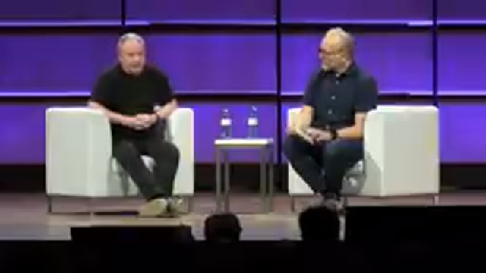
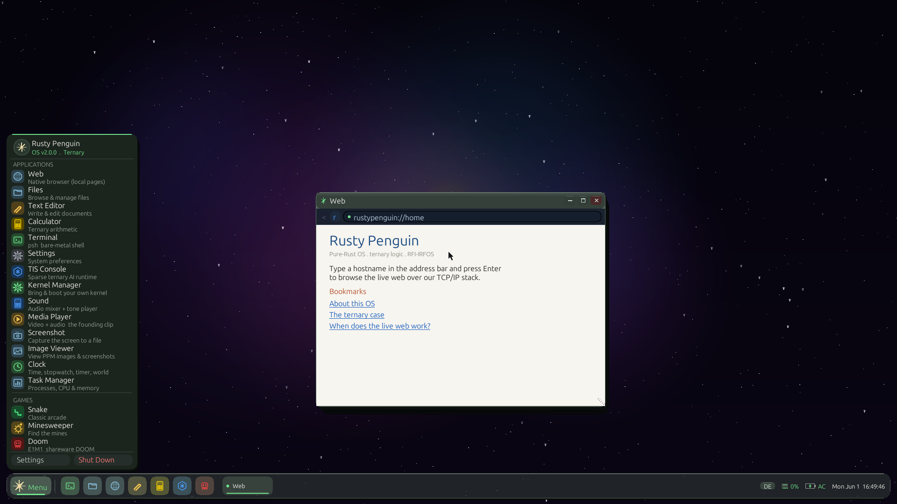

<p align="center">
  
</p>

<h1 align="center">Rusty Penguin</h1>

<p align="center"><em>A pure-Rust, from-scratch x86_64 operating system — kernel, drivers, GUI, all our own.</em></p>

<p align="center">

[](https://www.rust-lang.org/)
[](LICENSE)
[](https://github.com/rfi-irfos/rusty-penguin)
[](https://en.wikipedia.org/wiki/X86-64)
[](https://github.com/rfi-irfos/rusty-penguin)
[](https://github.com/rfi-irfos/rusty-penguin/pulse)

</p>

> *"I'm sure some clueless young person will decide 'how hard can it be?' and
> start his own operating system in Rust..."* — Linus Torvalds, Open Source
> Summit Europe 2024 ([keynote, 16:59](https://www.youtube.com/watch?v=OM_8UOPFpqE&t=1019s)).
> We were stupid enough — see [docs/ORIGIN.md](docs/ORIGIN.md).



*…and then we played that keynote back **on the kernel it triggered**. The actual
Torvalds/Hohndel talk, decoded by our own from-scratch `.rpv` codec and blitted to
our own framebuffer — no browser, no Linux, no external codec. It now ships as a
windowed **Media Player** app on the desktop (press **V** for a Windows-Media-Player-style
plasma visualizer). See [docs/META_VIDEO.md](docs/META_VIDEO.md).*

**Rusty Penguin is a complete operating system written from scratch in pure Rust —
its own bootloader, kernel, drivers, window manager and apps, with no Linux kernel
and no libc underneath. The goal: a daily-driver desktop OS you can install in
place of Ubuntu. Ternary logic (`-1 / 0 / +1`) is a first-class primitive at
every layer, from the scheduler to the AI runtime.**

Built by [RFI-IRFOS](https://github.com/rfi-irfos) as part of the
[Ternary Intelligence Stack](https://ternlang.com).
Preinstalled: `albert` · `ternlang` · `albert-cli` · `ternlang-mcp`

> **How it's built (the honest version):** a 5-person lab with heavy AI
> pair-programming — humans architect and direct, a lot of the code is AI-written
> under review, and every milestone is verified in QEMU before we claim it. We'd
> rather credit that than hide it. [`SESSION_LOG.md`](SESSION_LOG.md) tracks what's
> actually proven versus still open, and the gap table below stays deliberately
> truthful rather than aspirational. It's a research OS we're trying to grow into a
> daily driver — not one yet.



*The desktop with the start menu open and the native browser on `rustypenguin://home`,
over the warm "Nebula" wallpaper. The browser is real: point it at any host and it
fetches live over the from-scratch TCP/IP + TLS 1.3 stack — on boot it even
[googles the OS itself](docs/rusty-penguin-googling-itself.png), pulling
`google.com/search?q=rusty+penguin+os` over our own TLS with no X11, no Wayland, no
libc and no Linux kernel underneath.*

---

## Why a third state

The bits in the hardware are binary; the *logic* you build on top of them is a
design choice. Rusty Penguin builds on **balanced ternary** — digits `-1 / 0 / +1`
— the number system the Soviet [Setun](https://en.wikipedia.org/wiki/Setun)
computer ran on in 1958, and which Knuth called *"perhaps the prettiest number
system of all"* (TAOCP Vol. 2, §4.1). It's a real, well-studied base, not a
metaphor.

What the third digit buys us is that `0` carries meaning: **dormant**. Not
running, not stopped — *resting*. A process that hasn't been asked for anything
yet is not the same as a process that failed. A memory page that hasn't been
touched is not dead. A neural-network weight of zero should cost nothing to
compute.

Every primitive in this system expresses three states:

| Trit | Value | Meaning |
|---|---|---|
| Pos  | +1 | Active, running, promoted |
| Zero |  0 | Dormant, idle, neutral |
| Neg  | -1 | Suppressed, terminated, rejected |

Dormancy is sacred. Zero is not nothing — and the renderer, the scheduler and
the AI runtime all skip dormant work instead of grinding through it.

---

## What it is, concretely

A from-scratch x86_64 OS, written in Rust top to bottom:

- **Bootloader handoff → pure-Rust kernel** — Multiboot2, 32-bit → 64-bit long
  mode, physical/virtual memory management, interrupts, a custom syscall ABI,
  ring-3 userspace, PS/2 keyboard + mouse, a 1920×1080 framebuffer, and Intel
  HDA audio.
- **A native desktop** — frosted-glass window manager (drag / resize / minimize /
  maximize), a floating dock, a start menu, an arrow cursor, and a warm
  stone-green visual language. No external UI toolkit; every pixel is drawn by
  our own framebuffer + ternary-CSS engine.
- **Real apps** — terminal (psh), file manager (sortable, with a status bar),
  text editor (line numbers + Ln/Col status bar), calculator, system monitor,
  settings, the TIS console, a media player (kernel-decoded video + audio, with a
  Windows-Media-Player-style plasma visualizer easter egg), a screenshot tool
  (also right-click → Take Screenshot), an image viewer, a clock (live time +
  stopwatch + timer + world clocks), plus Snake, Minesweeper and a pure-Rust
  DOOM-style raycaster.
- **A ternary runtime** — balanced-ternary arithmetic and a sparse-skip
  inference engine that physically skips zero-weight multiplications.

No libc. No C dependencies. No UI framework. Systems programming from first
principles.

---

## Running the existing software world: the Linux ABI bridge

A from-scratch OS has a chicken-and-egg problem — none of the world's existing
software was compiled for it. We solve this **without giving up the pure-Rust
ternary core**: the kernel is growing a **Linux ABI compatibility layer** — a
one-way translation shim that lets unmodified, already-compiled Linux/glibc
binaries run on top of our Rust kernel.

This is not "boot Linux instead." There is no Linux kernel here. The native
syscall surface is our own, ternary-flavored ABI; the Linux ABI sits beside it
purely so the binary ecosystem (eventually a real browser) can run while the
native, ternary-native app ecosystem grows to replace it.

It is honest, brick-by-brick work:

- **Done:** the kernel runs real unmodified glibc programs natively — both
  statically and dynamically linked. `printf`, TLS (`__thread`), `malloc`, SSE
  floating point, full `atexit`/`exit`, file I/O, and `ld.so` loading +
  relocating + running a dynamically-linked binary against `libc.so.6`.
- **Next:** threads (`clone`/`futex`), per-process virtual memory + demand
  paging, `/proc`, more of the syscall surface, then a framebuffer GUI app —
  and on that road, a real web browser.

A browser is the long pole. Be clear-eyed: full web parity is a multi-year
horizon. The path is real and the early bricks are laid, but we don't pretend
velocity equals completion.

---

## Honest status

### The OS (bare-metal pure-Rust kernel — the product)
| Component | Status |
|---|---|
| Boot → long mode, memory mgmt, interrupts, syscalls, ring-3 | ✅ |
| Framebuffer 1920×1080, PS/2 keyboard + mouse | ✅ |
| **USB xHCI HID — keyboard + mouse on modern laptops** | ✅ QEMU verified |
| Intel HDA audio + Sound mixer app | ✅ |
| Window manager, floating dock, start menu, arrow cursor | ✅ |
| **Quick Settings panel (Wi-Fi/BT/dark/volume tiles, tray-anchored)** | ✅ GNOME-style |
| Apps: terminal, files, editor, calculator, monitor, settings, TIS console | ✅ |
| **File manager: sortable columns (name/size) + status bar** | ✅ |
| **Text editor: line numbers + Ln/Col/modified status bar** | ✅ QEMU-verified |
| **Media player (kernel-decoded video + audio in a window; WMP plasma visualizer easter egg)** | ✅ QEMU-verified |
| **Screenshot tool (capture screen → PPM; also right-click → Take Screenshot, Ctrl+P)** | ✅ QEMU-verified |
| **Image viewer (decodes PPM from the VFS; Ctrl+G)** | ✅ QEMU-verified |
| **Clock: live time + stopwatch + timer + world clocks** | ✅ QEMU-verified |
| **NIC drivers: RTL8139, Intel e1000/i219, Realtek r8169** | ✅ ~95% laptop coverage |
| **TCP/IP stack: ARP/ICMP/UDP/DHCP/DNS/TCP/HTTP** | ✅ fetches real internet |
| **TLS 1.3 client + X.509 certificate-chain validation (from scratch)** | ✅ real HTTPS verified to embedded CA roots (GTS R1 / ISRG X1) — no longer MITM-able, QEMU-verified vs live web |
| **Live web browser — type host → real page** | ✅ http + https, redirects, security lock indicator + back/forward history |
| `fetch`, `wget` terminal commands | ✅ |
| Linux ABI layer (static + dynamic glibc binaries) | ✅ Bricks 1–5 done |
| **id Software's real DOOM (fbDOOM) on the pure-Rust kernel via the Linux ABI** | ✅ boots + renders, QEMU-verified |
| **Preemptive multitasking + per-process address spaces (CR3) + ring-3 isolation** | ✅ scheduler foundation, QEMU-verified |
| **Hung-app isolation + watchdog force-quit (a wedged process can't freeze the system; it gets reaped)** | ✅ QEMU-verified behind flags |
| **Multi-process windowed apps (real ELF processes → isolated offscreen surfaces → compositor → on-screen windows; two apps at once; hung app force-quit)** | ✅ pipeline proven + screenshot-verified behind flags |
| **The real desktop run as a scheduled, isolated process** | ✅ QEMU-verified (`schedesktop` flag) — the bridge to a multi-process desktop |
| **The real desktop + a 2nd real app, both scheduled & isolated, no syscall-stack collision** | ✅ QEMU-verified (`schedesktop2` flag) — per-task syscall stack fixes the concurrent-syscall #GP |
| **The desktop composites a 2nd real app into an on-screen window** | ✅ QEMU-verified (`schedesktop2`) — the desktop (a scheduled process) hosts another isolated process's surface in a titled window; the model for windowed DOOM |
| **ACPI power management — S5 shutdown + reboot** | ✅ QEMU-verified; the Shut Down button powers the machine off |
| **Multi-user login (SHA-256 passwords, /home/<user>)** | ✅ |
| In-memory VFS within a session | ✅ |
| **RPFS v2 filesystem on AHCI (block-bitmap reclamation, real directories, 2048 files)** | ✅ files survive reboot; host-tested + QEMU-verified across a power cycle |

### The installed system (Linux track — the daily-driver path)
| Component | Status |
|---|---|
| Install to disk (`rp-install /dev/nvme0n1`) | ✅ UEFI/GPT |
| Standalone boot from disk (no ISO) | ✅ |
| Persistent `/home` (ext4) | ✅ survives reboots |
| Package manager (`rpm install <url>`) | ✅ with SHA-256 + ed25519 signing |
| **WiFi: wpa_supplicant + iw bundled** | ✅ auto-assoc on boot |
| **wifi-setup command** (console: `wifi-setup <SSID> <pass>`) | ✅ |
| Chrome / Firefox on X11 | ✅ |
| Recovery console | ✅ |

### Remaining gaps for "replace Ubuntu" daily driving
- GPU acceleration (framebuffer + from-scratch virtio-gpu 2D; no 3D/virgl yet — software rendering)
- WiFi on the bare-metal kernel: the Intel firmware-image parser is done and
  host-verified, but device bring-up (MMIO, firmware DMA, 802.11/WPA2) needs real
  Intel hardware — QEMU can't emulate iwlwifi. (The Linux track has full WiFi.)
- Battery / brightness / S3 suspend-resume (ACPI shutdown + reboot work; these
  need an AML interpreter, backlight access, and real power states)
- Multi-process desktop: the kernel side is proven end to end (real ELF
  processes in isolated address spaces → private offscreen surfaces → a
  compositor that blits them into on-screen windows, two apps at once). The
  remaining step is wiring the *real* desktop + real apps (fbDOOM) through this
  pipeline — the application-level refactor on top of the proven kernel work.
- **The real work-week path today: install to disk + rp.web mode**

---

## Boot it

### Zero-to-QEMU in one line

Paste this into a fresh Linux or macOS terminal. It installs the Rust toolchain
and all required tools, builds the ISO, and launches it in QEMU automatically:

```bash
curl -sSf https://raw.githubusercontent.com/rfi-irfos/rusty-penguin/main/install-dev.sh | bash
```

What it does: installs `rustup` (nightly + required targets), `grub-mkrescue`/
`xorriso`, and `qemu-system-x86_64` via your system package manager, clones the
repo, runs `bash iso/build.sh`, then launches `bash launch.sh`. Total time on a
fast connection: ~3 minutes.

### Manual setup (if you prefer)
```bash
# 1. Rust nightly + bare-metal targets
curl --proto '=https' --tlsv1.2 -sSf https://sh.rustup.rs | sh -s -- -y --default-toolchain nightly
source ~/.cargo/env
rustup component add rust-src --toolchain nightly

# 2. QEMU + ISO tools (Ubuntu/Debian)
sudo apt-get install -y qemu-system-x86 grub-pc-bin grub-efi-amd64-bin xorriso

# 3. Build + launch
git clone https://github.com/rfi-irfos/rusty-penguin && cd rusty-penguin
bash iso/build.sh && bash launch.sh
```

### On a real laptop (recommended path for daily driving)
```bash
# Flash to USB (replace /dev/sdX with your USB drive)
sudo dd if=rusty-penguin.iso of=/dev/sdX bs=4M status=progress && sync

# Boot from USB → GRUB menu:
#   "Rusty Penguin (bare metal)"  — pure-Rust kernel + desktop
#   "Rusty Penguin -- Web (X11)"  — Linux kernel + Chrome/Firefox
#
# First time: pick "Console / Install to disk", then:
#   rp-install /dev/nvme0n1       (or your disk)
#   wifi-setup MyNetwork MyPass   (if WiFi only)
```

### In QEMU
```bash
bash launch.sh
# Or with Intel e1000 NIC (real laptop test):
qemu-system-x86_64 -machine q35 -cdrom rusty-penguin.iso -m 512M \
  -netdev user,id=n0 -device e1000,netdev=n0 \
  -device qemu-xhci,id=xhci -device usb-kbd,bus=xhci.0 \
  -display sdl
```

The preselected GRUB entry, **Rusty Penguin (bare metal)**, boots the pure-Rust
kernel. For a full work week (browser, persistence, Git), use the
**Web (X11)** entry after installing to disk.

### It runs the real DOOM — on our own kernel

id Software's actual 1993 DOOM (fbDOOM, an **unmodified, dynamically-linked
glibc binary**) boots and renders on the **pure-Rust kernel** through the Linux
ABI layer — no Linux kernel underneath. The dynamic linker (`ld.so`) loads it
against `libc.so.6` (relocation, RELRO, TLS), then `D_DoomMain → W_Init` (loads
the WAD) `→ R_Init → I_InitGraphics` renders into our framebuffer. Verified
end-to-end via serial trace. Build it with `bash iso/build-real-doom.sh`.


A separate GRUB entry, **`Rusty Penguin -- DOOM (demoable)`**, boots straight
into DOOM without the desktop at all (for maximum performance demo).

**In progress:** running DOOM *windowed, next to the browser*. The kernel now
has preemptive multitasking, per-process address spaces (CR3), ring-3
process isolation, and a per-task syscall stack — so the **real desktop and a
second real app run concurrently** as isolated, preemptively-scheduled
processes without clobbering each other through the syscall path (the concurrent-
syscall #GP is fixed; `schedesktop2`, QEMU-verified — see `docs/SCHEDULER.md`).
The desktop — itself a scheduled process — now **composites a second real app's
live surface into a titled on-screen window** (`sys_app_surface`, QEMU-verified),
so the full windowed multi-app model is proven end to end with a synthetic app.
And the whole windowed-**Linux**-app pipeline is now proven end to end: a
dynamically-linked Linux binary runs as a scheduled process (`linuxdyn`), gets a
private `/dev/fb0` surface it renders into (`linuxfb`), and the desktop composites
that surface into a titled on-screen window (`linuxwin`, screendump
`docs/multiproc-linux-app-windowed.png`) — all QEMU-verified, 0 faults. Honest
status: real DOOM runs fullscreen as a standalone process today, and a *synthetic*
Linux app now runs **in a desktop window**; the only step left for windowed DOOM
is swapping that synthetic app for the real fbdoom binary (a dynamic PIE that loads
via the same path) and shaking out its DOOM-specific syscalls.

---

## The computational case for ternary

Balanced ternary represents the same range in fewer digits:

- 9 trits → ±9841 (vs 9 bits → ±255 unsigned)
- Multiplication maps to shift-and-add on a ternary number line
- Neural networks quantized to `{-1, 0, +1}` skip every zero-weight
  multiplication — the entire basis of the sparse `ai-runtime`

```
rp$ tri 6 * 7
  6 * 7 = 42
  ternary: 000000+-0 * 000000+-+ = 0000+---0

rp$ ai 8 4
sparse ternary inference -- 4 layers x dim 8
  L0 [00000+-0] -> [+-++-+++]  dormancy 79%
  ...
4 layers  avg dormancy 46%  skipped 120/256 ops
```

This is the same insight behind BitNet and ternary LLM quantization —
implemented here from first principles in Rust, running bare-metal in a bootable
OS. Each win is logged, with its honest basis, in `docs/TERNARY_FINDINGS.md` in
the [Ternary Intelligence Stack](https://ternlang.com) repo (the shared evidence
log for the whole stack, not just this OS).

---

## Part of the Ternary Intelligence Stack

| Module | Source |
|---|---|
| `compiler/` | ternlang-core lexer/parser/BET bytecode/VM |
| `filesystem/` | ternlang-fs VFS patterns |
| `ipc/` | ternlang-runtime TernNode actor model |
| `hardware-abstraction/` | ternlang-driver HAL traits |
| `ai-runtime/` | ternlang-ml TritTensor + sparse inference |

---

## License

MIT — see workspace `Cargo.toml`.
