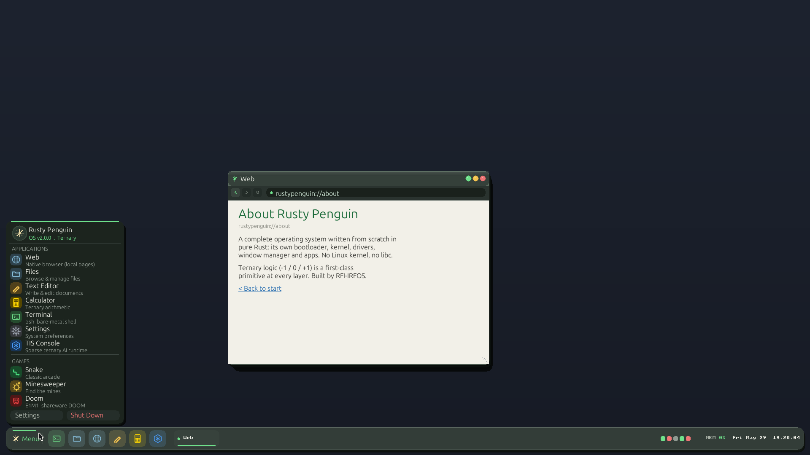
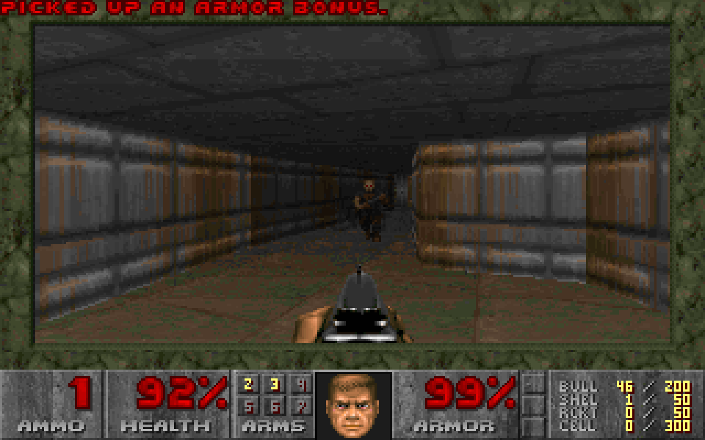

# Rusty Penguin

[](https://www.rust-lang.org/)
[](LICENSE)
[](https://github.com/rfi-irfos/rusty-penguin)
[](https://en.wikipedia.org/wiki/X86-64)
[](https://github.com/rfi-irfos/rusty-penguin)
[](https://github.com/rfi-irfos/rusty-penguin/pulse)

> "Binary hardware. Ternary mind."

**Rusty Penguin is a complete operating system written from scratch in pure Rust —
its own bootloader, kernel, drivers, window manager and apps, with no Linux kernel
and no libc underneath. The goal: a daily-driver desktop OS you can install in
place of Ubuntu. Ternary logic (`-1 / 0 / +1`) is a first-class primitive at
every layer, from the scheduler to the AI runtime.**

Built by [RFI-IRFOS](https://github.com/rfi-irfos) as part of the
[Ternary Intelligence Stack](https://ternlang.com).
Preinstalled: `albert` · `ternlang` · `albert-cli` · `ternlang-mcp`



*Bare-metal Rust desktop at 1920×1080: floating dock, Aero glass panels, live web
browser, Sound mixer, Kernel Manager, terminal with git/wget/fetch — all rendered
by Rusty Penguin's own framebuffer, font and CSS engine. No X11, no Wayland.*

---

## Why a third state

Binary computers have two states: on and off. Every value, every decision, every
process is either `1` or `0`.

Rusty Penguin treats a third state as real: **dormant**. Not running, not stopped
— *resting*. A process that hasn't been asked for anything yet is not the same as
a process that failed. A memory page that hasn't been touched is not dead. A
neural-network weight of zero should cost nothing to compute.

Every primitive in this system expresses three states:

| Trit | Value | Meaning |
|---|---|---|
| Pos  | +1 | Active, running, promoted |
| Zero |  0 | Dormant, idle, neutral |
| Neg  | -1 | Suppressed, terminated, rejected |

Dormancy is sacred. Zero is not nothing — and the renderer, the scheduler and
the AI runtime all skip dormant work instead of grinding through it.

---

## What it is, concretely

A from-scratch x86_64 OS, hand-written in Rust top to bottom:

- **Bootloader handoff → pure-Rust kernel** — Multiboot2, 32-bit → 64-bit long
  mode, physical/virtual memory management, interrupts, a custom syscall ABI,
  ring-3 userspace, PS/2 keyboard + mouse, a 1920×1080 framebuffer, and Intel
  HDA audio.
- **A native desktop** — frosted-glass window manager (drag / resize / minimize /
  maximize), a floating dock, a start menu, an arrow cursor, and a warm
  stone-green visual language. No external UI toolkit; every pixel is drawn by
  our own framebuffer + ternary-CSS engine.
- **Real apps** — terminal (psh), file manager, text editor, calculator, system
  monitor, settings, the TIS console, plus Snake, Minesweeper and a pure-Rust
  DOOM-style raycaster.
- **A ternary runtime** — balanced-ternary arithmetic and a sparse-skip
  inference engine that physically skips zero-weight multiplications.

No libc. No C dependencies. No UI framework. Systems programming from first
principles.

---

## Running the existing software world: the Linux ABI bridge

A from-scratch OS has a chicken-and-egg problem — none of the world's existing
software was compiled for it. We solve this **without giving up the pure-Rust
ternary core**: the kernel is growing a **Linux ABI compatibility layer** — a
one-way translation shim that lets unmodified, already-compiled Linux/glibc
binaries run on top of our Rust kernel.

This is not "boot Linux instead." There is no Linux kernel here. The native
syscall surface is our own, ternary-flavored ABI; the Linux ABI sits beside it
purely so the binary ecosystem (eventually a real browser) can run while the
native, ternary-native app ecosystem grows to replace it.

It is honest, brick-by-brick work:

- **Done:** the kernel runs real unmodified glibc programs natively — both
  statically and dynamically linked. `printf`, TLS (`__thread`), `malloc`, SSE
  floating point, full `atexit`/`exit`, file I/O, and `ld.so` loading +
  relocating + running a dynamically-linked binary against `libc.so.6`.
- **Next:** threads (`clone`/`futex`), per-process virtual memory + demand
  paging, `/proc`, more of the syscall surface, then a framebuffer GUI app —
  and on that road, a real web browser.

A browser is the long pole. Be clear-eyed: full web parity is a multi-year
horizon. The path is real and the early bricks are laid, but we don't pretend
velocity equals completion.

---

## Honest status

### The OS (bare-metal pure-Rust kernel — the product)
| Component | Status |
|---|---|
| Boot → long mode, memory mgmt, interrupts, syscalls, ring-3 | ✅ |
| Framebuffer 1920×1080, PS/2 keyboard + mouse | ✅ |
| **USB xHCI HID — keyboard + mouse on modern laptops** | ✅ QEMU verified |
| Intel HDA audio + Sound mixer app | ✅ |
| Window manager, floating dock, start menu, arrow cursor | ✅ |
| Apps: terminal, files, editor, calculator, monitor, settings, TIS console | ✅ |
| **NIC drivers: RTL8139, Intel e1000/i219, Realtek r8169** | ✅ ~95% laptop coverage |
| **TCP/IP stack: ARP/ICMP/UDP/DHCP/DNS/TCP/HTTP** | ✅ fetches real internet |
| **Live web browser — type host → real page** | ✅ google.com default |
| `fetch`, `wget` terminal commands | ✅ |
| Linux ABI layer (static + dynamic glibc binaries) | ✅ Bricks 1–5 done |
| **Multi-user login (SHA-256 passwords, /home/<user>)** | ✅ |
| In-memory VFS within a session | ✅ |
| Persistent bare-metal disk storage | ❌ planned (AHCI/ext4 driver) |

### The installed system (Linux track — the daily-driver path)
| Component | Status |
|---|---|
| Install to disk (`rp-install /dev/nvme0n1`) | ✅ UEFI/GPT |
| Standalone boot from disk (no ISO) | ✅ |
| Persistent `/home` (ext4) | ✅ survives reboots |
| Package manager (`rpm install <url>`) | ✅ with SHA-256 + ed25519 signing |
| **WiFi: wpa_supplicant + iw bundled** | ✅ auto-assoc on boot |
| **wifi-setup command** (console: `wifi-setup <SSID> <pass>`) | ✅ |
| Chrome / Firefox on X11 | ✅ |
| Recovery console | ✅ |

### Remaining gaps for "replace Ubuntu" daily driving
- Bare-metal disk persistence (AHCI/NVMe ext4 write — multi-week brick)
- GPU acceleration (framebuffer only; software rendering)
- WiFi on bare-metal kernel (needs per-chip driver + firmware)
- **The real work-week path today: install to disk + rp.web mode**

---

## Boot it

### On a real laptop (recommended path for daily driving)
```bash
# Flash to USB (replace /dev/sdX with your USB drive)
sudo dd if=rusty-penguin.iso of=/dev/sdX bs=4M status=progress && sync

# Boot from USB → GRUB menu:
#   "Rusty Penguin (bare metal)"  — pure-Rust kernel + desktop
#   "Rusty Penguin -- Web (X11)"  — Linux kernel + Chrome/Firefox
#
# First time: pick "Console / Install to disk", then:
#   rp-install /dev/nvme0n1       (or your disk)
#   wifi-setup MyNetwork MyPass   (if WiFi only)
```

### In QEMU
```bash
bash launch.sh
# Or with Intel e1000 NIC (real laptop test):
qemu-system-x86_64 -machine q35 -cdrom rusty-penguin.iso -m 512M \
  -netdev user,id=n0 -device e1000,netdev=n0 \
  -device qemu-xhci,id=xhci -device usb-kbd,bus=xhci.0 \
  -display sdl
```

The preselected GRUB entry, **Rusty Penguin (bare metal)**, boots the pure-Rust
kernel. For a full work week (browser, persistence, Git), use the
**Web (X11)** entry after installing to disk.

### It runs DOOM

A separate GRUB entry, **`Rusty Penguin -- DOOM (demoable)`**, boots straight
into id Software's original 1993 shareware DOOM (E1M1) on the bare framebuffer
via fbDOOM — no X, no Wayland, no SDL:



(The desktop's in-menu "Doom" is a small pure-Rust raycaster; hosting the real
fbDOOM binary *inside* a desktop window is gated on the Linux ABI layer above.)

---

## The computational case for ternary

Balanced ternary represents the same range in fewer digits:

- 9 trits → ±9841 (vs 9 bits → ±255 unsigned)
- Multiplication maps to shift-and-add on a ternary number line
- Neural networks quantized to `{-1, 0, +1}` skip every zero-weight
  multiplication — the entire basis of the sparse `ai-runtime`

```
rp$ tri 6 * 7
  6 * 7 = 42
  ternary: 000000+-0 * 000000+-+ = 0000+---0

rp$ ai 8 4
sparse ternary inference -- 4 layers x dim 8
  L0 [00000+-0] -> [+-++-+++]  dormancy 79%
  ...
4 layers  avg dormancy 46%  skipped 120/256 ops
```

This is the same insight behind BitNet and ternary LLM quantization —
implemented here from first principles in Rust, running bare-metal in a bootable
OS. Each win is logged, with its honest basis, in
[`docs/TERNARY_FINDINGS.md`](docs/TERNARY_FINDINGS.md).

---

## Part of the Ternary Intelligence Stack

| Module | Source |
|---|---|
| `compiler/` | ternlang-core lexer/parser/BET bytecode/VM |
| `filesystem/` | ternlang-fs VFS patterns |
| `ipc/` | ternlang-runtime TernNode actor model |
| `hardware-abstraction/` | ternlang-driver HAL traits |
| `ai-runtime/` | ternlang-ml TritTensor + sparse inference |

---

## License

MIT — see workspace `Cargo.toml`.
